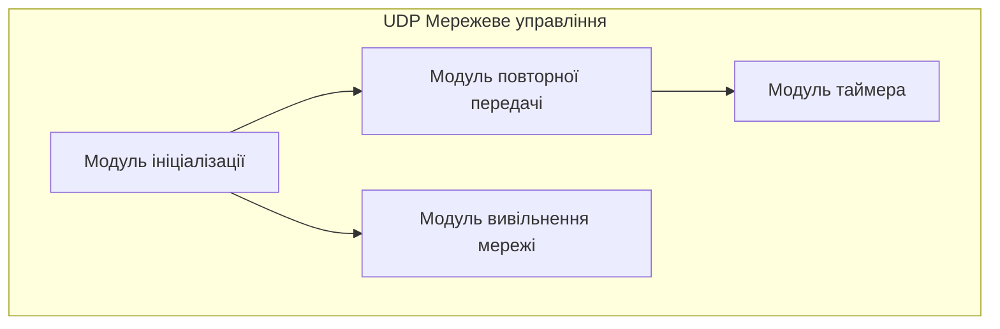
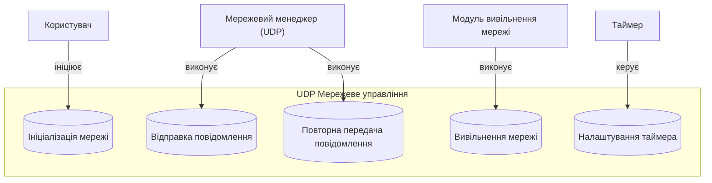

# Software Requirements Specification для проекту "UDP Мережеве управління"

## 1. Вступ

### 1.1 Мета документа
Метою цього документа є визначення вимог до програмного забезпечення для управління мережевими з'єднаннями через UDP, зокрема для автомобільних та вбудованих систем. Документ описує функціональні та нефункціональні вимоги, інтерфейси та критерії тестування.

### 1.2 Призначення програмного забезпечення
Програмне забезпечення призначене для:
- Ініціалізації мережевого з'єднання.
- Управління повторною передачею повідомлень.
- Налаштування та обробки таймерів для циклічної відправки повідомлень.
- Вивільнення мережі після завершення з'єднання.

### 1.3 Область застосування
Система буде використовуватися в автомобільних та вбудованих системах, де необхідно забезпечити надійне та ефективне мережеве з'єднання через UDP.

---

## 2. Огляд системи

### 2.1 Опис системи загалом
Система складається з чотирьох основних модулів:
1. **Модуль ініціалізації**: ініціалізує мережеві параметри.
2. **Модуль повторної передачі**: управляє повторними передачами повідомлень.
3. **Модуль таймера**: налаштовує та обробляє таймери для повторних передач.
4. **Модуль вивільнення мережі**: завершує з'єднання та вивільняє мережу.

### 2.2 Короткий огляд функціональності та основних компонентів
- **Модуль ініціалізації**: забезпечує налаштування мережі та ініціалізацію UDP.
- **Модуль повторної передачі**: перевіряє стан мережі та ініціює повторну передачу повідомлень.
- **Модуль таймера**: контролює інтервали передачі повідомлень.
- **Модуль вивільнення мережі**: перевіряє активні з'єднання та вивільняє мережу.

---

## 2.3 Схема системної архітектури

## 3. Вимоги до продукту

### 3.1 Функціональні вимоги

- **Ініціалізація мережевого менеджменту**: система повинна ініціалізувати мережеве з'єднання та налаштувати основні параметри для UDP зв'язку.
- **Відправка повторного повідомлення**: якщо повідомлення не надіслано, система повинна ініціювати повторну передачу через встановлений інтервал.
- **Вивільнення мережі**: коли система більше не потребує мережевого з'єднання, вона повинна викликати функцію вивільнення мережі.

### 3.2 Нефункціональні вимоги

- **Надійність**: втрата даних не більше 0.1% всіх операцій запису; відмовостійкість: перезапуск при помилках < 1%.
- **Безпека**: мережеві з'єднання повинні бути безпечними та захищеними від атак.
- **Сумісність**: система повинна працювати на вбудованих пристроях з обмеженими ресурсами (пам'ять, процесор).
- **Технічна підтримка**: повинна бути передбачена технічна підтримка для користувачів системи.

---

## 4. Вимоги до інтерфейсу

### 4.1 Опис інтерфейсів користувача
- **Інтерфейс налаштування мережі**: користувач повинен мати можливість налаштувати мережеві параметри через простий текстовий інтерфейс.

### 4.2 Опис API
- **API для ініціалізації мережі**: функція для ініціалізації мережевого з'єднання.
- **API для повторної передачі**: функція для ініціації повторної передачі повідомлень.
- **API для вивільнення мережі**: функція для завершення з'єднання та вивільнення мережі.

---

## 5. Вимоги до тестування

- **План тестування**: повинні бути розроблені тести для перевірки функціональності кожного модуля, зокрема для ініціалізації мережі, повторної передачі повідомлень та вивільнення мережі.
- **Критерії приймання**: система повинна відповідати всім функціональним та нефункціональним вимогам, визначеним у цьому документі.

---

## 6. Вимоги до документації

### 6.1 Вимоги до документації користувача
- **Посібник користувача**: детальний опис налаштування та використання системи.
- **Інструкції з усунення несправностей**: поради щодо вирішення можливих проблем.

### 6.2 Вимоги до документації розробника
- **Технічна документація**: детальний опис архітектури системи, включаючи схеми компонентів та інтерфейсів.
- **Документація API**: опис функцій API, їх параметрів та використання.

---

## 7. Інші розділи (за потреби)

### 7.1 Ліцензія
- **Ліцензія на використання**: система повинна бути ліцензована відповідно до обраної моделі (наприклад, open-source або комерційна ліцензія).

### 7.2 План випуску
- **Графік розробки**: визначення етапів розробки та термінів їх виконання.
- **Плани тестування та впровадження**: визначення етапів тестування та впровадження системи.
